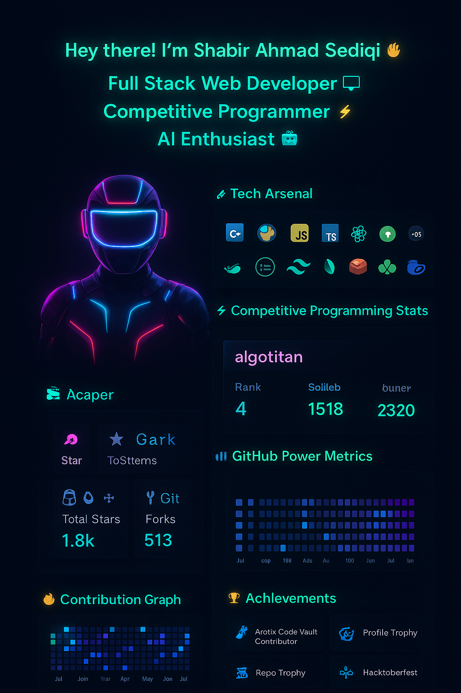

  <!-- Header image: upload the generated image as ./header.png in the repo root -->
  

<h2 align="center" style="margin-top: 8px;">Hey there! I'm <strong>Shabir Ahmad Sediqi</strong> 👋</h2>

Full Stack Web Developer • Competitive Programmer • AI Enthusiast

---

  <a href="https://my-portfolio-zeta-seven-57.vercel.app/" title="Portfolio">Portfolio</a> •
  <a href="mailto:shabirsediqi@proton.me" title="Email">shabirsediqi@proton.me</a> •
  <a href="https://codeforces.com/profile/algotitan" title="Codeforces">algotitan</a>

---

### 🔭 What I do
- Building web apps with **Next.js, React, Node.js** and shipping reliable production systems.
- Competitive programming (Codeforces: **algotitan**) — algorithm-first mindset.
- Learning **AI & Mathematics** to bring smarter features into products.

---

### 🧰 Tech Arsenal

  

---

### ⚡ Live Cards & Stats

  <!-- Codeforces stats card -->
  
  <!-- GitHub stats -->
  

  
  

---

### 🏆 Achievements

  

---

### ✨ Fun Fact
> I turn caffeine into code and debug while questioning reality 😎

---

  Designed in Cyberpunk mode • Built by <strong>Shabir Ahmad Sediqi</strong>

